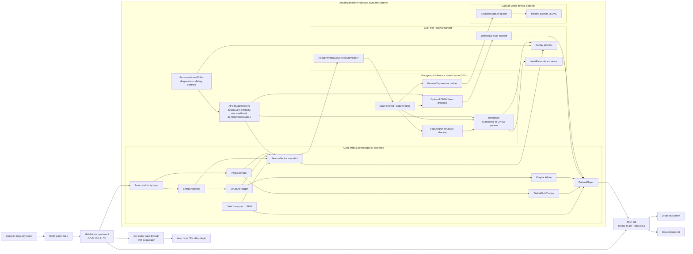

# Architecture — Fuzzyband (Metal Accompaniment)

> This document describes the component boundaries, threading model, and data
> flow for the current implementation. Originally written for Phase 1 rule-based;
> updated to reflect **ONNX inference**, **feature capture**, and **extracted
> modules** from v0.5.0 Phase 31 (PlaybackGate, StablePitchTracker,
> PatternRules). Tempo is sourced from the DAW transport; the audio-derived tempo path
> (`OnsetDetector`) has been retired. Current focus: **Data Improvement Strategy**
> ([`docs/DATA_STRATEGY.md`](docs/DATA_STRATEGY.md)).

---

## High-Level Overview



---

## Component Reference

### Tempo source (DAW transport)

**Where:** `AccompanimentProcessor::processBlock` (audio thread)  
**Purpose:** Provide the beat clock BPM for `PatternPlayer` and `FeatureVector`.

The DAW transport is the single source of tempo: `getPlayHead()->getPosition()->getBpm()`.
If no valid host BPM is available (e.g. the standalone build, or a stopped transport),
the manual `bpm` APVTS parameter is used, falling back to 120 BPM. There is **no
audio-derived tempo estimator** — the earlier `OnsetDetector` (spectral-flux onset +
inter-onset-interval BPM) has been retired.

---

### `EnergyAnalyser`

**File:** `src/analysis/EnergyAnalyser.h/.cpp`  
**Thread:** Audio (called from `processBlock`)  
**Purpose:** Computes RMS energy and spectral features used to classify the
current guitar state.

**Outputs:**
- `rmsEnergy` — 100ms rolling RMS, normalised 0..1
- `spectralCentroid` — weighted mean frequency (distinguishes palm mute from open chord)
- `highFreqFlux` — flux in 2kHz+ band (presence / attack content)

**Public interface:**
```cpp
class EnergyAnalyser {
public:
    void prepare(double sampleRate, int blockSize);
    void process(const float* audioData, int numSamples);
    float getRmsEnergy()       const;
    float getSpectralCentroid() const;
    float getHighFreqFlux()    const;
};
```

---

### `StructureTagger`

**File:** `src/analysis/StructureTagger.h/.cpp`  
**Thread:** Audio (called from `processBlock`)  
**Purpose:** Converts raw energy/spectral features into a discrete structural
state with hysteresis to prevent flickering.

**States:**
```cpp
enum class StructureState { SILENT, VERSE, CHORUS, BREAKDOWN };
```

**State transitions (threshold-based):**

```
rmsEnergy < 0.05                    → SILENT
rmsEnergy >= 0.05, centroid < 1200Hz → BREAKDOWN (half-time feel)
rmsEnergy >= 0.05, centroid < 2400Hz → VERSE
rmsEnergy >= 0.05, centroid >= 2400Hz → CHORUS
```

Hysteresis: minimum 2 seconds in any state before a transition is allowed.
This prevents a single quiet moment mid-riff from dropping to SILENT.

**Public interface:**
```cpp
class StructureTagger {
public:
    void prepare(double sampleRate);
    StructureState update(float rms, float centroid, float highFreqFlux);
    StructureState getCurrentState() const;
};
```

---

### `FeatureVector`

**File:** `src/analysis/FeatureVector.h`  
**Purpose:** Plain data struct passed from the audio thread to the inference
background thread via the lock-free queue. Must be trivially copyable.

```cpp
struct FeatureVector {
    float bpm;
    float rmsEnergy;
    float spectralCentroid;
    float highFreqFlux;
    StructureState state;
    int64_t sampleTimestamp; // for latency measurement
};
```

---

### `IInference` (interface)

**File:** `src/inference/IInference.h`  
**Purpose:** Abstract interface that decouples the inference implementation from
the rest of the plugin. Production uses `MetalGrooveInference` when
`MA_ENABLE_ONNX` is on; otherwise `RuleBasedInference`. Either can be swapped
without touching the audio thread.

```cpp
class IInference {
public:
    virtual ~IInference() = default;

    // Called once at startup. May allocate, load models, etc.
    virtual void prepare(double sampleRate) = 0;

    // Called at ~50Hz on the background thread. Must not block indefinitely.
    // Returns a pattern index into the MidiPatternLibrary.
    virtual int selectPattern(const FeatureVector& features) = 0;

    // Human-readable name for debug UI
    virtual std::string getName() const = 0;
};
```

---

### `RuleBasedInference` (Phase 1)

**File:** `src/inference/RuleBasedInference.h/.cpp`  
**Thread:** Background inference thread  
**Purpose:** Implements `IInference` using hand-authored rules. No ML.

**Logic:**
```
SILENT    → pattern index 0  (all-off / silence)
VERSE     + bpm < 120 → pattern 1  (slow verse groove)
VERSE     + bpm < 160 → pattern 2  (mid verse groove)
VERSE     + bpm >= 160 → pattern 3 (fast verse groove)
CHORUS    + bpm < 160 → pattern 4  (mid chorus, open hi-hat)
CHORUS    + bpm >= 160 → pattern 5 (fast chorus, double kick)
BREAKDOWN → pattern 6  (half-time, heavy ghost notes)
```

---

### `MetalGrooveInference` (production path when `MA_ENABLE_ONNX=ON`)

**File:** `src/inference/MetalGrooveInference.h/.cpp`  
**Thread:** Background inference thread  
**Purpose:** Implements `IInference` using ONNX Runtime against
`assets/metal_groove.onnx` (22-class mel-CNN), bundled as JUCE `BinaryData`.

`AccompanimentProcessor` constructs `MetalGrooveInference` and calls
`tryLoadModel()`. If loading fails (or the option is off), it uses
`RuleBasedInference` instead — no audio-thread change either way. A failed
load is loud (Debug `jassert` plus `getActiveInferenceName()` in tests) so a
stale dylib cannot masquerade as working ML.

The background drain feeds `selectPatternFromMel()` from a 64×32 (or 64×40)
mel window. Scalar `selectPattern(FeatureVector)` is the rule-based fallback
when the mel path is unavailable. Style classification (`classifyStyle`)
runs from the same drain.

The legacy scalar `OnnxInference` / `assets/accompaniment_model.onnx` path is
retired; see [`docs/DATA_STRATEGY.md`](docs/DATA_STRATEGY.md).

---

### `MidiPatternLibrary`

**File:** `src/midi/MidiPatternLibrary.h/.cpp`  
**Purpose:** Stores all drum and bass patterns as `constexpr` data. No file I/O.

```cpp
struct MidiEvent {
    uint8_t note;
    uint8_t velocity;
    float   beatOffset;   // in beats, e.g. 0.5 = eighth note into bar
    float   durationBeats;
};

struct MidiPattern {
    std::string          name;
    float                lengthInBars;
    std::vector<MidiEvent> drumEvents; // channel 10
    std::vector<MidiEvent> bassEvents; // channel 2
};

class MidiPatternLibrary {
public:
    const MidiPattern& getPattern(int index) const;
    int                patternCount() const;
};
```

Pattern indices 0–6 correspond to the outputs of `RuleBasedInference`.

---

### `PatternPlayer`

**File:** `src/midi/PatternPlayer.h/.cpp`  
**Thread:** Audio (called from `processBlock`)  
**Purpose:** Reads the current pattern index (via atomic), maintains a beat
clock, and fills the JUCE `MidiBuffer` with note-on/off events.

**Key behaviours:**
- Beat clock derived from the DAW **transport** sample position (see [Tempo source](#tempo-source-daw-transport) and [Two clocks](#two-clocks-transport-vs-monotonic))
- Pattern transitions are quantised to bar boundaries to avoid mid-bar glitches
- Note velocity is humanised: ±10 random offset per hit
- Note timing is humanised: ±2ms random offset per hit
- Sends a note-off flush when switching to SILENT state

**Public interface:**
```cpp
class PatternPlayer {
public:
    void prepare(double sampleRate, int blockSize);
    void setPatternIndex(int index);      // called by audio thread
    void process(MidiBuffer& midi,
                 int numSamples,
                 int64_t hostSamplePosition);
};
```

---

### Two clocks: transport vs monotonic

Lock and transition **schedules** must not share the drum grid's host
playhead. A DAW loop wrap jumps `getTimeInSamples()` backwards, which used
to freeze `grooveLockEndSample` and silence frozen bass.

| Clock | Source | Used for |
|---|---|---|
| Transport | `PatternPlayer::previewResolvedHostSample` / host `getTimeInSamples()` | Drum + grid-bass placement, click, fills, bar phase |
| Monotonic | `hostSampleTime` (plugin sample counter, never wraps) | `grooveLockStartMono` / `grooveLockEndMono`, `transitionStartMono` / `transitionEndMono`, frozen-riff origin |

At lock / transition engage, `latchLockClock` stores `lockOriginMono =
hostSampleTime` and `lockBarPhaseBeats = fmod(transportBeats, 4)` so the
frozen bass re-enters on the audible drum downbeat. Durations are
`hostSampleTime` deltas; a loop wrap cannot prevent expiry. A seek
(`PatternPlayer::consumeTransportJumped`) re-latches bar phase and origin
while preserving remaining duration.

UI riff snapshots (`riffA` / `riffB` / `enginePhase`) are published through
a triple buffer so the message thread never races the audio thread on the
64-slot grids (T8.2).

---

### `AccompanimentProcessor` (top-level plugin)

**File:** `src/AccompanimentProcessor.h/.cpp`  
**Purpose:** The `juce::AudioProcessor` subclass. Owns all components.
Runs the inference background thread.

**Ownership:**
```
AccompanimentProcessor
├── EnergyAnalyser
├── StructureTagger
├── std::unique_ptr<IInference>    ← RuleBasedInference or MetalGrooveInference
├── MidiPatternLibrary
├── PatternPlayer
├── std::atomic<int>               ← pattern index handoff (acquire/release with inference/UI)
├── std::atomic<int>               ← debug preview sample countdown (paired with pattern index)
├── std::atomic<double>            ← cached sample rate (UI thread reads for debug pattern length)
├── moodycamel::ReaderWriterQueue  ← feature handoff
└── std::thread                    ← inference loop
```

**Lifecycle:** The inference thread is created in the constructor but stays idle (`inferencePaused == true`) until `prepareToPlay()` finishes, so `IInference::prepare(sampleRate)` always runs before the loop calls `selectPattern()`.

**Input path:** Non-finite samples are cleared to 0, then the buffer is clipped to `[-2, 2]` (SIMD `clip` alone is not sufficient for NaN on all targets).

**Sample rate:** `prepareToPlay` clamps a non-positive rate to 44100 Hz before wiring components; `EnergyAnalyser` and `StructureTagger` each guard again if `prepare()` is ever called with an invalid rate.

**Soft bypass:** `processBlockBypassed()` clears MIDI, sends all-notes-off, resets the pattern player, and copies mono input to the right channel so the dry guitar still reaches the output.

---

## Threading Model

This is the most important section. Get this wrong and you get either audio
glitches (audio thread blocked) or crashes (data races).

### Audio thread

Runs in `processBlock()`. Has a hard real-time deadline (~5ms at 256 samples /
48kHz). **Must never:**
- Allocate or free heap memory
- Acquire a mutex
- Call any OS blocking primitive
- Access the filesystem
- Call ONNX Runtime directly

**What it does:**
1. Scrubs non-finite input samples, then clips to `[-2, 2]`
2. Reads the DAW transport BPM (manual-knob / 120 fallback) and calls `EnergyAnalyser::process()`
3. Calls `StructureTagger::update()` to get current state
4. Pushes a `FeatureVector` onto the lock-free queue (non-blocking, always succeeds)
5. Reads `latestPatternIndex` via `std::atomic::load(memory_order_acquire)` (pairs with inference/UI stores)
6. Decrements `debugPreviewSamplesRemaining` with acquire load / release store when the debug pattern preview is active
7. Calls `PatternPlayer::process()` to fill `MidiBuffer`

### Background inference thread

Runs in a `std::thread` at ~50Hz (20ms sleep between iterations).
**Responsibilities:**
1. Pop `FeatureVector` from the lock-free queue
2. Call `IInference::selectPattern()` (may take 1–10ms, that's fine here)
3. If the debug preview countdown is not active, write result to `latestPatternIndex` via `std::atomic::store(memory_order_release)`

### Handoff primitives

| Data | Mechanism | Rationale |
|---|---|---|
| Feature vector (audio → inference) | `moodycamel::ReaderWriterQueue` | Single-producer single-consumer, wait-free, no allocation |
| Pattern index (inference/UI → audio) | `std::atomic<int>` with acquire/release | Coordinates with UI-driven debug pattern + preview countdown |
| Preview countdown (UI ↔ audio ↔ inference) | `std::atomic<int>` with acquire/release | Prevents inference from overwriting the pattern while preview is active |
| Sample rate (audio → UI) | `std::atomic<double>` | `bumpDebugPattern()` runs on the message thread |

### Why not a mutex?

A mutex on the audio thread means the OS can preempt it while it holds the lock,
causing a priority inversion that produces an audible glitch or xrun. Lock-free
primitives have bounded, allocation-free operation that is safe on a real-time
thread.

---

## Data Flow (per audio block)

```
processBlock() called by host
        │
        ├─► scrub non-finite samples; clip to [-2, 2]
        │
        ├─► read DAW transport BPM (manual-knob / 120 fallback)
        │
        ├─► EnergyAnalyser::process(audioData)
        │       └─► updates rms, centroid, highFreqFlux
        │
        ├─► StructureTagger::update(rms, centroid, flux)
        │       └─► returns current StructureState
        │
        ├─► Build FeatureVector { bpm, rms, centroid, flux, state }
        │
        ├─► featureQueue.try_enqueue(featureVector)   [non-blocking]
        │
        ├─► int pattern = latestPatternIndex.load(acquire)
        │
        └─► PatternPlayer::process(midiBuffer, numSamples, hostPosition)
                └─► fills MidiBuffer with drum + bass MIDI events


[Background thread, ~50Hz]
        │
        ├─► featureQueue.try_dequeue(featureVector)
        │
        ├─► if preview inactive: int pattern = inference->selectPattern(featureVector)
        │
        └─► latestPatternIndex.store(pattern, release)   [when preview countdown == 0]
```

---

## MIDI Channel Convention

| Channel | Content | Notes |
|---|---|---|
| 10 | Drums | GM standard drum channel |
| 2 | Bass | Arbitrary, configurable in future UI |

Both channels are emitted into the same `MidiBuffer` returned from `processBlock`.
The host DAW routes them to separate VSTi tracks.

---

## Build Targets

| Target | Description |
|---|---|
| `MetalAccompaniment_VST3` | VST3 plugin binary |
| `MetalAccompaniment_AU` | Audio Unit (macOS only) |
| `MetalAccompaniment_Standalone` | Standalone app for testing without a DAW |
| `PluginData` | BinaryData library (ONNX model, future assets) |
| `MetalAccompanimentTests` | Unit test binary (Catch2) |

---

## Extending inference

To swap the pattern selector:

1. Implement a new `IInference` (see `MetalGrooveInference`)
2. In `AccompanimentProcessor`'s factory (`makeInference()`), construct it
   and call `tryLoadModel()` if it loads weights
3. Nothing else changes. The audio thread, pattern player, and MIDI output are
   completely unaware of which inference implementation is active.

Pitch/chord detection is already in the live path (`PitchEstimator` /
`StablePitchTracker`); do not re-add a parallel detector.
