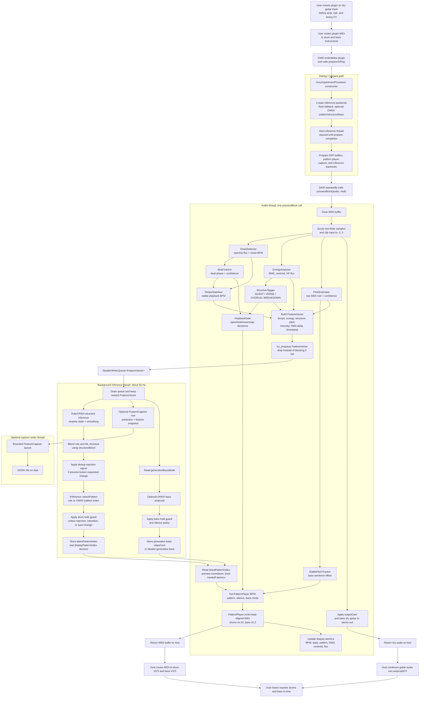

# Runtime Architecture

This document maps the live runtime connections: which thread owns what, which data crosses boundaries, and how audio becomes MIDI.

## Thread Model

| Thread | Owner | Work | Must Not Do |
|---|---|---|---|
| Audio thread | DAW/JUCE calls `processBlock()` | DSP analysis, queue feature snapshots, read pattern atomics, emit MIDI, pass audio through | Block, allocate unpredictably, do file I/O, call ONNX |
| Inference thread | `AccompanimentProcessor` | Drain `FeatureVector` queue, run rule/ONNX inference, update atomics and bass handoff state | Touch JUCE UI, block audio thread |
| Message/UI thread | JUCE editor | Draw UI, handle button clicks, read display atomics | Directly mutate DSP internals without a thread-safe handoff |
| Capture writer thread | `FeatureCapture` | Write JSONL rows to disk when capture is enabled | Run on audio thread |

## Data Flow Diagram

## Ownership Boundaries

### Processor-Owned Subsystems

`AccompanimentProcessor` owns every runtime subsystem by value where possible, and by `std::unique_ptr` for polymorphic or optional inference backends (`src/AccompanimentProcessor.h:103`).

By-value ownership is good here because most DSP objects have clear lifetime: constructed with the processor, prepared before playback, reused every block.

### Audio-to-Inference Queue

The queue is `moodycamel::ReaderWriterQueue<FeatureVector> featureQueue{4096}` (`src/AccompanimentProcessor.h:122`).

- Producer: audio thread in `processBlock()`.
- Consumer: inference thread in `drainFeatureQueueAndRunInference()`.
- Behavior: the inference thread drains every available item and keeps the newest (`src/AccompanimentProcessor.cpp:194`).
- Backpressure policy: audio thread drops if enqueue fails (`src/AccompanimentProcessor.cpp:503`).

That drop policy is appropriate for a live plugin. A stale feature vector is less useful than keeping the audio callback fast.

### Pattern Handoff

The inference thread writes `latestPatternIndex`; the audio thread reads it (`src/AccompanimentProcessor.h:123`).

`PatternPlayer` then stores it as a requested pattern and commits at the next bar boundary (`src/midi/PatternPlayer.cpp:429`). This separates "decision time" from "musical change time."

### Display Handoff

Display values are atomics (`displayBpm`, `displayStateIndex`, `displayPatternIndex`, RMS, centroid, HF flux, beat confidence). The audio thread writes them; the UI thread reads them through processor getters.

This is a good JUCE pattern for live diagnostic labels.

### Generative Bass Handoff

The inference thread writes:

- `genBassPitchOffsets[16]`
- `genBassVelocities[16]`
- `genBassRootMidi`
- `genBassStepsReady`
- `useGenerativeBass`

The audio thread reads and clears `genBassStepsReady` (`src/AccompanimentProcessor.cpp:519`).

The intent is single-producer/single-consumer. The risk is that the arrays and root are plain non-atomic fields guarded only by an atomic flag (`src/AccompanimentProcessor.h:127`). Release/acquire on the flag orders visibility, but the plain fields are still concurrently accessed by different threads under the C++ memory model. A safer design is a small SPSC queue or double-buffered struct with an atomic index.

## Lifecycle

### Construction

The processor:

1. Creates APVTS parameters.
2. Creates inference implementations. ONNX implementations are attempted when `MA_ENABLE_ONNX` is defined; otherwise rules are used.
3. Sets the pattern library pointer on `PatternPlayer`.
4. Starts `inferenceThread`.

This happens in `src/AccompanimentProcessor.cpp:111`.

### Prepare

`prepareToPlay()` pauses inference, prepares analysis buffers and pattern playback, resets runtime state, prepares capture and inference, then resumes inference (`src/AccompanimentProcessor.cpp:140`).

This is where most DSP memory allocation happens. That is correct: JUCE hosts call `prepareToPlay()` outside the tight per-block audio loop.

### Audio Block

`processBlock()` is covered step by step in [Codebase Walkthrough](CODEBASE_WALKTHROUGH.md). The most important architectural point: `processBlock()` only communicates with background work through atomics and queues.

### Release and Destruction

`releaseResources()` pauses inference (`src/AccompanimentProcessor.cpp:184`). The destructor stops and joins the inference thread (`src/AccompanimentProcessor.cpp:126`).

`FeatureCapture` follows the same RAII pattern: destructor calls `stop()`, which joins the writer thread and drains queued rows (`src/capture/FeatureCapture.cpp:105`, `src/capture/FeatureCapture.cpp:138`).

## Build-Time Architecture

`CMakeLists.txt` defines the plugin target and test targets.

Key switches:

- `MA_BUILD_TESTS`: builds Catch2 tests.
- `MA_BUILD_STANDALONE`: includes JUCE standalone app format.
- `MA_ENABLE_ONNX`: compiles ONNX Runtime support and bundles model assets.

Default builds leave ONNX off. That means the plugin still builds and runs with rule inference and static pattern bass.

## Test Architecture

There are two C++ test executables:

- `MetalAccompanimentTests`: unit tests for analysis, inference rules, MIDI, capture, etc.
- `MetalAccompanimentIntegrationTests`: links the full plugin target and runs processor pipeline / E2E tests.

The test list in `CMakeLists.txt` is broad and useful. Coverage includes:

- onset detection
- energy analysis
- structure tagging and smoothing
- beat tracking
- playback gate
- stable pitch tracking
- pattern rules
- pattern player
- generative bass
- feature capture
- processor pipeline
- E2E silent/BPM/transition behavior

## Current Architectural Strengths

- ONNX does not run on the audio thread.
- The audio callback drops stale feature work instead of waiting.
- Pattern changes land at bar boundaries.
- Feature capture is off-thread and bounded.
- Tests cover many historically fragile audio behavior areas.
- Several earlier processor responsibilities have already been extracted into focused classes (`PlaybackGate`, `TempoStabiliser`, `StablePitchTracker`, `pattern_rules.h`).

## Current Architectural Pressure Points

- `AccompanimentProcessor.cpp` is still the largest source file at 633 lines and contains lifecycle, analysis orchestration, inference policy, feature capture row construction, and bass handoff policy.
- `PatternPlayer.cpp` is 456 lines and owns several related but distinct jobs: pattern scheduling, MIDI emission, humanization, static bass note-offs, generative bass note-offs, and transition crashes.
- ONNX classes allocate small wrapper objects during inference calls (`Ort::MemoryInfo`, `Ort::Value`, output vectors). This is acceptable only because those calls are on the background thread.
- The generative bass handoff uses plain arrays across threads. This is the main concurrency item to revisit before treating the code as fully hardened.
